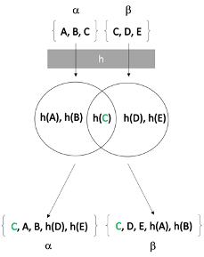

# Private Set Intersection

Using the SHA256 algorithm we achieve some basic security requirements for addressing the insider threat by implementing a naïve Private Set Intersection (PSI) protocol. Suppose an organization is attempting to reduce the amount of information that would otherwise be divulged by an inside attacker. Currently the organization has two departments, Dep. A and Dep. B, that each own sensitive sets containing comparable elements, SA and SB respectively. Assume Alice and Evil Bob are employees, in Dep. A and Dep. B and are able to respond to set intersection requests only. Assume the goal of an inside attacker Evil Bob is to divulge the maximal amount of any secret information at one time. Note that since Evil Bob is an insider, it is assumed he can communicate with Alice securely. Now consider the case where Evil Bob sends Alice his set and requests an intersection. Alice then computes the intersection and returns it to Evil Bob. However, even though Evil bob failed to divulge the union of the secret sets it doesn’t matter since our original assumption is naïve. If we instead consider that Alice is equally likely to be an inside attacker, we realize that in all cases an inside attacker can divulge the maximal amount of any secret information. To solve this problem Alice and Evil Bob first compute the SHA256 of each element in their set. One party then sends their hashed set to the receiver who computes the intersection. This approach is known as Private Set Intersection (PSI) since both parties only learn at most the intersection of their sets. This is the case since SHA256 is a one-way hash function meaning that any elements in the difference of the sets won’t be leaked to the other party.

  

However, this assumption is naïve since the set of comparable elements being hashed are usually small (e.g.: the names of people, email addresses, IP’s). This means that a malicious sender or receiver could easily brute force guess the hashes of elements in the intersection or difference. We can improve this example by requiring Alice and Evil Bob hash sets of objects instead of elements. By rehashing elements in the object along with the previous hash and some random session key computational security is increased against malicious inside threats. However, this is only a moderate improvement if the elements are simple but effective in either case if the elements are complex (e.g.: a multi-page document, ssh-keys, or complex passwords). Lastly, the Diffie-Hellman protocol can be implemented instead of relying on hashing sufficiently complex elements or large collections of object elements. Conceptually the idea remains the same except the security is derived from the discrete log problem which is much harder.

## Element Wise PSI (26 elements)

## Object Wise PSI (26^3 ~ 2^14 objects)

